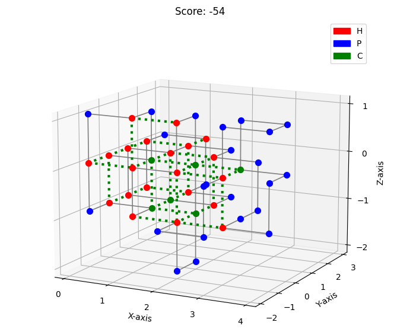
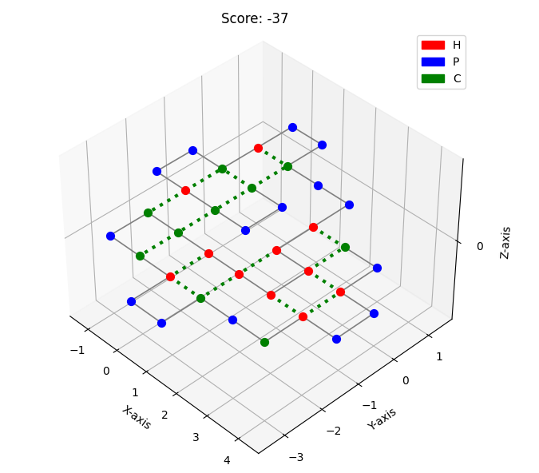

# Heuristics Protein Pow(d)er
### By Fons van de Hare, Sunita Rijs and Lotte Notenboom, june 2022 

 


## Case Description
Proteins are large, complex strings of amino acids that play many important roles in all living organisms. They do most of the work in cells and are required for the structure, function, and regulation of the body’s tissues and organs. The amino acids are arranged in a certain way, 'folding' the protein to it's final form. The way this folding is executed, is crucial for the correct functioning of the protein, making the protein 'stable' or low in energy. If a protein is folded incorrectly, it can cause malfunctions such as diseases.

Understanding how this folding comes about and attempting to recreate the folding proces has been an important topic studied in science and biology the last thirty years. Computational scientists have also been trying to recreate this proces using varying computer algorithms.

For our project we've attempted to simulate this folding using the hydrophobic-polar protein folding model. This is a highly simplified model for examining protein folds in space. Even though this model abstracts away many of the details of protein folding, it is still an NP-hard problem on both 2D and 3D square lattices.
The amino acid types are limited to hydrophobic (H), polar (P) and cystein (C). Interactions between H-amino's, C-amino's and between H- and C-amino's contribute to the stability of proteins. The goal is to fold the proteins in such a way that produces the lowest stability (or score).

Below is a 2D-example of a protein folding of the protein 'HPPPPHHHPCHCCPH'. The '|' represents the line combining the amino acids in one long protein string. If amino's of type 'C' and 'H' are placed next to each other (one space apart on the grid, but NOT connected), this leads to an increase in stability. Each '\*'-connection represents a bond formed between amino acids that generate points. H\*H = -1 point, C\*H = -1 point, C\*C = -5 points.


                                                             P-P
                                                             | |
                                                             P H   H-C*H
                                                             | *   | | |
                                                             P-H-H C*C-P
                                                                 | |
                                                                 H-P


Limitations: amino acids each need their own place/coordinates on the grid and the path the amino's follow must be self-avoiding.
  
Using the guidelines above, we've implemented eight different constructive and iterative algorithms to try and find the best possible (lowest) scores for a selection of protein strings. They are explained below. 
  
## Algorithms
### Constructive

#### Randomize
This algorithm generates a 3D-folded self-avoiding protein by choosing a random move for each amino acid. There are six move options, corresponding with the directions within a 3D-grid. The amino acids are placed on the grid one at a time, starting at the beginning of the protein-string. For each amino, a random move is chosen from the list of possible moves. The coordinates of the amino acid being placed on the grid are determined by adding a move eg. (1, 0, 0) to the coordinates of the previous amino acid eg. (2, 0, 1), thus placing the new amino acid at (3, 0, 1) on the grid. Next, these coordinates are checked against a list with coordinates currently occupied by amino acids, to prevent overlap of aminos. If the coordinates are already occupied, a new random move is chosen until this results in a free spot. If a free spot is found, the coordinates are assigned to the protein model and the algorithm moves on to the next amino acid.

#### Greedy
This algorithm bases it's moves on what move gets the highest score at that time. It's a depth-first approach without look-ahead. 

#### Depth First
This algorithm checks every possible way a protein can be folded. This works as follows: there are five (three for 2D foldings) possible options to place the next amino acid. The depth-first algorithm chooses a space to put the amino acid and then moves on to place the next amino acid. This depth first way of searching is created because the algorithm uses a stack. The last conformation added is the first to get re-evaluated at the next step. The algorithm keeps running until all possible conformations have been placed at the grid, thus covering the entire state-space. 

#### Breadth First
This algorithm inherites a lot of functions from the depth first algorithm and also goes through the entire state-space. Instead of placing one amino and then moving on to the next in the chain (depth-first), this algorithm places an amino acid on the grid and then creates a new partial conformation that places the same amino on another spot in the grid. So after two aminos are placed on the grid, it will create all new possible states from that partial conformation with the third amino. After all possible conformations from the third are created, it moves on to the fourth and so on. 

#### Beam Breadth Search
This algorithm is based on a breadth first algorithm. It uses a 'beam' to keep a steady number of states that are evaluated to build further upon. This prevents branching and the exponential increase in running time with longer strings. If a beam of 30 is chosen, ONLY the thirty conformations with the best scores are being kept, the other states are discarded. Scores are evaluated every time a new partial conformation is made. This results in a running time that is lower than the that of the branch and bound algorithm, while resulting in better scores. We tweaked the algorithm based on the heuristic that it 's only necessary to evaluate fifty percent of conformations that have the same score as the current best score. We found that this decreased the running time without having impact on the scores that are generated. Running this algorithm does come with a slight chance that it will not reach a complete conformation. When running it on a large protein string and handling a small beam it can happen that not enough conformations are kept and the folding will run into itself because there are no free spaces left on the grid.

#### Branch And Bound
This algorithm inherites functionalties from the Beam Breadth algorithm. It uses a different pruning strategy than the Beam Breadth algorithm. It compares scores of partial conformations that have the same length. If a score is worse than average, it has a very low chance of being kept. If the score is between average and the best score, this chance is slightly higher. Conformations with the best score have a fifty percent chance of being kept. Because this strategy generates increasingly more states with longer strings, the running time is longer than that of the Beam Breadth algorithm. This implementation was inspired by [this paper](https://www.brown.edu/Research/Istrail_Lab/_proFolding/papers/2005/bran-06.pdf).

### Iterative algorithms

#### Hill Climber

#### Random Hill Climber
This algorithm starts of by executing the randomize algorithm once to place a protein on the grid. After this, at each iteration it chooses two random amino acids and reassigns the coordinates of the amino acids in between, creating a new path that fits between the two amino acids, by calculating the Manhattan distances. The rest of the protein remains untouched. If a new path is not valid (eg. amino's are placed on the same space), the new path is discarded and new next mutation is performed on the old conformation. If the new conformation is valid, the score of the new conformation is compared to that of the old conformation. Conformations with a score of 1 of 2 worse than the old conformation have a 50% chance of being kept, based on the heuristic  that this will generally generate higher results in the end. Conformations that have the same score or a better score are being kept per definition.

#### Random Simulated Annealing
This algorithm inherites functionality from the Random Hill Climber algorithm. It uses a temperature to determine a chance that a conformation with a score that is sub-optimal is being kept. This is to avoid getting stuck in a local optimum and reaching a global optimum by exploring options that have a worse score than best at the time, because there is a chance that those will lead to a better score in the end. The temperature decreases over the number of iterations. So nearer to the end, it will gradually stop accepting conformations that have a worse score.

## Getting started
  
1. Change into the program folder 
```
cd final_product
```
<br>

3. Install requirements 
```
pip3 install -r requirements.txt
```
<br>

4. Execute the program by running 
```
python3 main.py
```
<br>
  
5. This will launch a menu that will take you through some questions, eg. what protein string you would like to fold and what algorithm is used to fold it with. 
<br>

4. If you would like to try the program on protein strings not included in the sample, you could substitute them for any string you want consisting of 'H', 'P' and 'C' by replacing one of the strings in the file 'data/proteins.txt'.

## Approach and retrospect 
During our research and tweaking of the algorithms, we found out that our biggest challenge was the time it took to run the program, because the running time increases exponentionally when protein strings get longer. Because we got the best results by letting the algorithm fold lots of different conformations, we started optimizing and refactoring our code. We did this by doing profiling runs on our code to see what actions took up a lot of running time (results of the profiling runs can be viewed in the data map). We found out that deepcopying took up a lot of time, so we changed our code and added a copy function to our protein Model. We profiled the program again and the running time had decreased from 42.6 seconds to 3.81 seconds.
This allowed us to work further on our constructive algorithms, which had generated the best results so far. From our Branch And Bound algorithm, we moved on to a Beam Breadth Search algorithm that takes the partial conformations with the best scores and discards the others. This approach turned out to work well in combination with the optimization, because we were able to also fold the longer proteins that took way too much time before in a couple of minutes now. The scores resulting from the foldings also improved a lot. We knew the best possible scores for some proteins ranging from length 14 to 50 and were now able to achieve those scores for all of the proteins.
After this, we explored some more iterative algorithms. Although the results were better than a lot of results we generated in the beginning of the proces and the running time was no longer an issue, the iterative algorithms didn't generate scores that were as good as the Beam Search algorithm. However, we think there is a lot of potential for the future in combining the constructive and iterative algorithms, especially after tweaking our iterative algorithms some more.
  
## Protein folding competition
[Here](protein.quinner.nl) you can see the results of our Beam Breadth Search algorithm (we're team Pikachurine) on the folding of different proteins, varying in dimension en length.
  
## Thanks
We would like to thank the staff at the minor Programming at the University of Amsterdam for their guidance and support during the creation of this project.  
